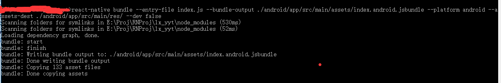

# react-native-update-js
热更新组件，可自行配置服务，只需在后台放个配置文件即可，也可以自己写一个接口<br/>
可根据后台返回的历史版本，随意切换（后台配置，建议使用接口，因为读取后台文件（如xxx.json），有的时候右有缓存）

##### 支持平台：目前只支持ios (android版，等本人空下来就开发)

### 安装
npm i --save react-native-update-js

### 安装依赖（必须）：
[npm i --save react-native-fs 文件操作组件](https://github.com/itinance/react-native-fs)<BR/>
[npm i --save react-native-zip-archive 解压缩组件](https://github.com/plrthink/react-native-zip-archive)<BR/>


### 最新版（1.0.4）配置
###### 自动配置
react-native link react-native-update-js
###### 手动配置
1.Xcode打开项目，右击Libraries ➜ Add Files to [your project's name] ，到node_modules/react-native-update-js/ios下添加 .xcodeproj 文件<BR/>
2.选中项目到Build Phases ➜ Link Binary With Libraries，点击下边的“+”，添加“libRNUpdateAppJs.a”<BR/>
3.到Build Settings ➜ Search Paths ➜ Header Search Paths，添加“$(SRCROOT)/../node_modules/react-native-update-js/ios/RNUpdateAppJs”选项选择“non-recursive”<BR/>
###### 代码配置
```cpp
#import "RNUpateAppJs.h"

- (BOOL)application:(UIApplication *)application didFinishLaunchingWithOptions:(NSDictionary *)launchOptions
{
#if DEBUG
  // 原来的jsCodeLocation保留在这里
  jsCodeLocation = ..........
#else
  // 非DEBUG情况下启用热更新
  jsCodeLocation=[RNUpateAppJs bundleURL];
#endif
  // ... 其它代码
}
```
###### HotUpdate 的后台配置（若是文件，文件编码最好是utf-8，即普通文本文件）（配置后台文件或接口(get请求)，自由选择）例如下列示例(有一个我测试放在后台的json文件，在[lib文件夹](./lib/update.json)下，可参考)
```javascript
{
            "ios-lx_yyt-2.0.7":{//这key是这样设置,ios："ios-" + HotUpdate.tag + "-" + packageVersion = "lx_yyt-2.0.7";android："android-" + HotUpdate.tag + "-" + packageVersion = "lx_yyt-2.0.7";
                "tag":"lx_yyt",//app设置的标识 ，HotUpdate.tag="lx_yyt"设置的一致
                "packageVersion":"2.0.7",//app的静态版本(硬版本)号，即编译时设置的版本号，此发生变化就会去下载新的静态版本(硬版本)
                "downloadUrl":"https://itunes.apple.com/cn/app/id1438062830?l=en&mt=8",//静态版本(硬版本)下载地址
                "description":"yyy",//静态版本(硬版本)描述
                "metaInfoPkg":{//元信息可在里面自定义一些数据,app的静态版本(硬版本)，更新时回传
                    "rnUpdate":true//此字段是我测试项目自定义的，是否开启react-native-update热更新，默认false关闭，使用自定义热更新；true开启，使用react-native-update热更新，只能选择一种
                },
                "publishJS":[//发布的js所有版本,默认第一个是最新发布的的js版本,可任选一个更新
                    {
                        "description": "asdfsa",//js描述
                        "version": "2.0.140",//js的版本号
                        "build": 12,// 构建值（数字），只可增大，不可重复，用于比对版本是否升级
                        "metaInfo":{//元信息可在里面自定义一些数据，js的版本，更新时回传
                        },
                        "updateUrl": "http://yyt.lexin580.com:8081/app_config/lx_yyt_app.zip" //js包
                    }
                ]

       }
}
```

### 历史版本（1.0.3及其之前）配置
###### 代码配置
在项目目录的node_modules/save react-native-update-js/ios下找到update文件夹
将文件夹拖入你的项目ios项目，然后打开AppDelegate.m文件,按下列代码写入
```cpp
#import "UpateAppJs.h"

- (BOOL)application:(UIApplication *)application didFinishLaunchingWithOptions:(NSDictionary *)launchOptions
{
#if DEBUG
  // 原来的jsCodeLocation保留在这里
  jsCodeLocation = ..........
#else
  // 非DEBUG情况下启用热更新
  jsCodeLocation=[UpateAppJs bundleURL];
#endif
  // ... 其它代码
}
```
###### HotUpdate 的后台配置，（配置后台文件或接口，自由选择）例如下列示例(有一个我测试放在后台的json文件，在[lib文件夹](https://github.com/gegeyang0124/react-native-update-js/blob/master/lib/update.json)下，可参考)
```javascript
{
            "ios-lx_yyt-2.0.7":{//这key是这样设置,ios："ios-" + HotUpdate.tag + "-" + packageVersion = "lx_yyt-2.0.7";android："android-" + HotUpdate.tag + "-" + packageVersion = "lx_yyt-2.0.7";
                "tag":"lx_yyt",//app设置的标识 ，HotUpdate.tag="lx_yyt"设置的一致
                "packageVersion":"2.0.7",//app的静态版本(硬版本)号，即编译时设置的版本号，此发生变化就会去下载新的静态版本(硬版本)
                "downloadUrl":"https://itunes.apple.com/cn/app/id1438062830?l=en&mt=8",//静态版本(硬版本)下载地址
                "description":"yyy",//静态版本(硬版本)描述
                "metaInfoPkg":{//元信息可在里面自定义一些数据,app的静态版本(硬版本)，更新时回传
                    "rnUpdate":true//此字段是我测试项目自定义的，是否开启react-native-update热更新，默认false关闭，使用自定义热更新；true开启，使用react-native-update热更新，只能选择一种
                },
                "publishJS":[//发布的js所有版本,默认第一个是最新发布的的js版本,可任选一个更新
                    {
                        "description": "asdfsa",//js描述
                        "version": "2.0.140",//js的版本号，只能增大
                        "metaInfo":{//元信息可在里面自定义一些数据，js的版本，更新时回传
                        },
                        "updateUrl": "http://yyt.yyy.com:8081/app_config/lx_yyt_app.zip" //js包
                    }
                ]

        }
}
```


##### 使用 HotUpdate 热更新，以下以下方法详细参数请看源文件,里面有详细注解
```javascript
import {
packageVersion,//app的静态版本(硬版本)号，即编译时设置的版本号，此发生变化就会去下载新的静态版本(硬版本)
currentVersion,//动态版本号，即当前运行的js程序的js版本号
mainBundleFilePath,//js代码路径 指向main.jsbundle
build,// 构建值（数字），只可增大，不可重复，用于比对版本是否升级
HotUpdate
} from "react-native-update-js";

HotUpdate.host="http://....";//热更新配置文件地址或接口，//get请求
HotUpdate.tag = "";//热更新的标志 与后台配置一致 必须设置 默认为"''"
HotUpdate.checkUpdate();//检查更新
HotUpdate.downloadUpdate();//下载更新
HotUpdate.doUpdate();//更新重载应用

版本1.0.3及其之前的api
HotUpdate.getAppInfo();//获取更新即时版本信息

版本1.0.3之后的api
HotUpdate.markSuccess();//标记更新成功，若js无bug则标记成功，若有bug则回滚到前一个js版本
```


## 热更新发布
执行js打包命令：<BR/>

##### ios:<BR/>
react-native bundle --entry-file index.js --bundle-output ./ios/main.jsbundle --platform ios --assets-dest ./ios --dev false

#### android:<BR/>
react-native bundle --entry-file index.js --bundle-output ./android/app/src/main/assets/index.android.jsbundle --platform android --assets-dest ./android/app/src/main/res/ --dev false

找到ios下打包的文件和文件夹;分别是ios下的文件夹assets，文件main.jsbundle和main.jsbundle.meta;
将他们复制到一个文件夹下压缩成zip文件，放到自己的服务器上，将下载地址放到updateUrl的字段里即可。
<BR/>
Android 同理
<BR/>

<BR/>
以上的“热更新发布”是按我的打包命令，生成文件的路径找到的，具体路径，看你自己的打包命令的生成路径；
如以上ios的assets:--assets-dest ./ios,在ios的目录下；main.jsbundle和main.jsbundle.meta： --bundle-output ./ios/main.jsbundle
也在ios的目录下
<BR/>
Android 同理
<BR/>
也可以在命令执行后看命令输出目录：<BR/>



##### [示列代码](./example/HotUpdateTest.js)

### 欢迎交流
欢迎提问交流；若有bug，请添加bug截图或代码片段，以便更快更好的解决问题。<br>
欢迎大家一起交流

### [我的博客](http://blog.sina.com.cn/s/articlelist_6078695441_0_1.html)
